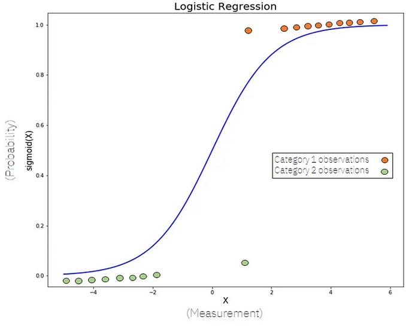
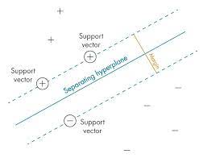
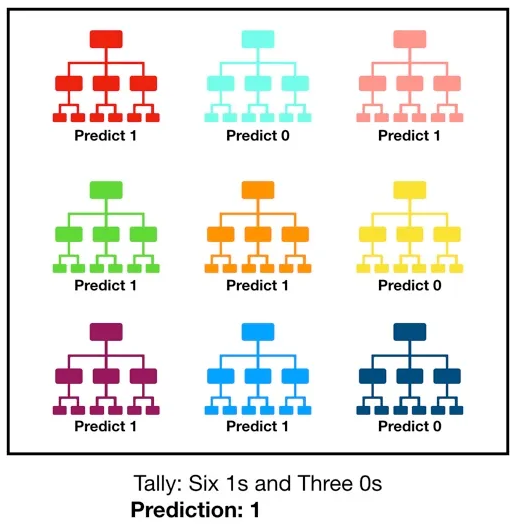
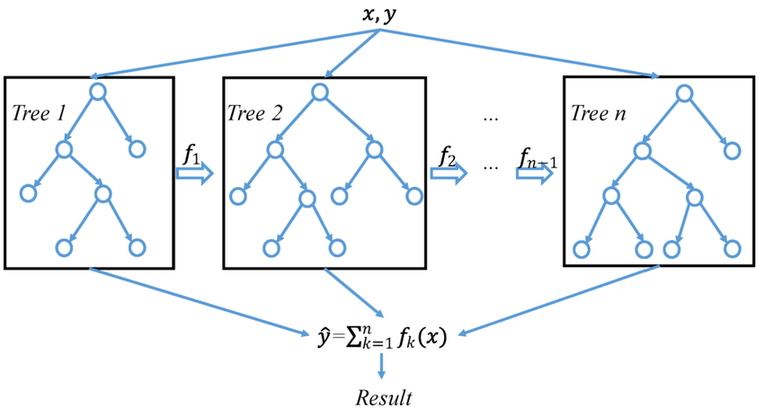
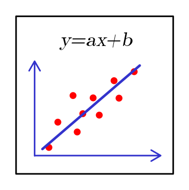

# [Dev IA GRETA / Lécroart Antoine](https://github.com/Dev-IA-2024/antoine.lecroart)

[↩️](..)
---

# Recherche sur les différents modèles IA

---
---

## Classification

---

### <b>Régression logistique</b>

<p align="center">

</p>

#### Méthode d'apprentissage :

&nbsp;&nbsp;&nbsp;&nbsp;Les modèles de régression logistique sont des modèles qui ont un certain nombre fixe de paramètres qui dépendent du nombre de caractéristiques d'entrée, et qu'ils produisent des prédictions catégoriques, comme par exemple si une plante appartient ou non à une certaine espèce.<br> 
Dans la régression logistique, nous n'ajustons pas directement une ligne droite à nos données comme dans la régression linéaire. Au lieu de cela, nous ajustons une courbe en forme de S, appelée sigmoïde, à nos observations.
    
#### Équation :

&nbsp;&nbsp;&nbsp;&nbsp;L'équation de la régression logistique est :

>$$ Sigmoid(x)= {1 \over 1+e^{-x}} $$

&nbsp;&nbsp;&nbsp;&nbsp;Où :

- $x = Θ * value + b$ est la somme pondérée des caractéristiques d'entrée(value).

> Le but de l'entrainement est de trouver $Θ$ et $b$

#### Hyperparamètres :

- `Solver` (lbfgs, sag, liblinear,...)
- `penalty` (l1, l2, elasticnet)
- `C (penalty strength)`


#### Exemple de code :

```python
from sklearn.linear_model import LogisticRegression

# Création du modèle
model = LogisticRegression(
    solver = 'saga', 
    penalty = 'elasticnet', 
    C=1.2
)

# Entraînement du modèle
model.fit(X_train, y_train)

# Prédiction
y_pred = model.predict(X_test)
```

---

### <b>SVM (Support Vector Machine)</b>

<p align="center">

</p>

#### Méthode d'apprentissage :

&nbsp;&nbsp;&nbsp;&nbsp;SVM ou Support Vector Machine est un modèle linéaire pour les problèmes de classification et de régression. Il peut résoudre des problèmes linéaires et non linéaires et fonctionne bien pour de nombreux problèmes pratiques. L'idée du SVM est simple : L'algorithme crée une ligne ou un hyperplan qui sépare les données en classes.<br> 
Selon l'algorithme SVM, nous trouvons les points les plus proches de la ligne dans les deux classes. Ces points sont appelés vecteurs de support. Nous calculons ensuite la distance entre la ligne et les vecteurs de support. Cette distance est appelée marge. Notre objectif est de maximiser la marge. L'hyperplan pour lequel la marge est maximale est l'hyperplan optimal.
    
#### Équation :

&nbsp;&nbsp;&nbsp;&nbsp;L'équation d'un SVM est :

>$$ f(x)= sign(∑_{i=1}^nα_iy_i⟨x,x_i⟩+b) $$

&nbsp;&nbsp;&nbsp;&nbsp;Où :

- $x$ est l'instance d'entrée.
- $x_i$ sont les vecteurs d'entraînement.
- $y_i$ sont les étiquettes de classe correspondantes.
- $α_i$ sont les coefficients du modèle, qui sont estimés lors de l'apprentissage.
- $b$ est le biais du modèle.

#### Hyperparamètres :

- `C` : Contrôle le compromis entre la maximisation de la marge et la minimisation de l'erreur d'entraînement (ajoute une pénalité pour chaque point de données mal classé.). <br>
- `Kernel (linear, poly, rbf, sigmoid, precomputed)` : Spécifie la fonction noyau à utiliser pour projeter les données dans un espace de dimension supérieure.
- `epsilon` : la marge d'erreur autour de la ligne de régression.

#### Exemple de code :

```python
from sklearn.svm import SVC

# Création du modèle
model = SVC(
    kernel='rbf', 
    C=1.5
)

# Entraînement du modèle
model.fit(X_train, y_train)

# Prédiction
y_pred = model.predict(X_test)
```

---

### <b>Arbre de décision</b>

<p align="center">

</p>

#### Méthode d'apprentissage :

&nbsp;&nbsp;&nbsp;&nbsp;Un arbre de décision est un type d'apprentissage automatique supervisé utilisé pour catégoriser ou faire des prédictions sur la base des réponses données à un ensemble de questions antérieures. Le modèle est une forme d'apprentissage supervisé, ce qui signifie qu'il est formé et testé sur un ensemble de données contenant la catégorisation souhaitée. 
    
#### Équation :
<a name="tree"></a>

&nbsp;&nbsp;&nbsp;&nbsp;L'équation d'un arbre de décision n'est pas généralement exprimée sous forme d'une seule équation mathématique. Les arbres de décision sont des modèles d'apprentissage automatique utilisés pour la classification ou la régression. Ils sont construits à partir d'une série de règles de décision basées sur les caractéristiques (variables indépendantes) d'un ensemble de données.<br>

&nbsp;&nbsp;&nbsp;&nbsp;Chaque nœud de l'arbre représente une décision basée sur une caractéristique spécifique, et chaque branche représente une condition basée sur cette caractéristique. Les feuilles de l'arbre correspondent aux étiquettes de classe ou aux valeurs de sortie.<br>

&nbsp;&nbsp;&nbsp;&nbsp;La construction d'un arbre de décision implique généralement l'utilisation d'algorithmes tels que CART (Classification and Regression Trees) ou ID3 (Iterative Dichotomiser 3) pour sélectionner les caractéristiques les plus informatives et créer les règles de décision.<br>

&nbsp;&nbsp;&nbsp;&nbsp;Donc, plutôt que d'avoir une seule équation, un arbre de décision est représenté par sa structure d'arborescence et les règles de décision associées à chaque nœud et branche.<br>


#### Hyperparamètres :

&nbsp;&nbsp;&nbsp;&nbsp;`Criterion` : critère utilisé pour mesurer la qualité de la division à chaque nœud de l'arbre. <br>
&nbsp;&nbsp;&nbsp;&nbsp;`Max_depth` : Limite la profondeur de l'arbre. <br>
&nbsp;&nbsp;&nbsp;&nbsp;`Min_samples_split` : Nombre minimum d'échantillons requis pour diviser un nœud.

#### Exemple de code :

```python
from sklearn.tree import DecisionTreeClassifier

# Création du modèle
model = DecisionTreeClassifier(
    criterion='gini',
    max_depth=3,
    min_samples_leaf=2
)

# Entraînement du modèle
model.fit(X_train, y_train)

# Prédiction
y_pred = model.predict(X_test)
```

---

### <b>Forêt aléatoire</b>

<p align="center">

</p>

#### Méthode d'apprentissage :

&nbsp;&nbsp;&nbsp;&nbsp;La forêt aléatoire, comme son nom l'indique, se compose d'un grand nombre d'arbres de décision individuels qui fonctionnent comme un ensemble. Chaque arbre individuel de la forêt aléatoire émet une prédiction de classe et la classe ayant le plus de votes devient la prédiction du modèle.
    
#### Équation :

[cf. arbre de décision](#tree)

#### Hyperparamètres :
<a name="randfo"></a>
&nbsp;&nbsp;&nbsp;&nbsp;[cf. Arbre de décision](#tree) <br>
&nbsp;&nbsp;&nbsp;&nbsp;`N_estimators` : Nombre d'arbres dans la forêt. <br>
&nbsp;&nbsp;&nbsp;&nbsp;`Max_features` : Nombre maximum de caractéristiques à considérer lors de la recherche de la meilleure division à chaque nœud.

#### Exemple de code :

```python
from sklearn.ensemble import RandomForestClassifier

# Création du modèle
model = RandomForestClassifier(
    n_estimators=50,
    criterion='entropy',
    max_depth=10,
    min_samples_split=1.5,
    max_features='log2'
)

# Entraînement du modèle
model.fit(X_train, y_train)

# Prédiction
y_pred = model.predict(X_test)
```

---

### <b>XGBoost</b>

<p align="center">

</p>

#### Méthode d'apprentissage :

&nbsp;&nbsp;&nbsp;&nbsp;XGBoost (eXtreme Gradient Boosting) est basé sur la technique du boosting, qui consiste à combiner plusieurs modèles d'apprentissage faibles pour former un modèle plus fort et plus précis. <br>
L'idée centrale derrière XGBoost est d'ajouter de manière itérative des arbres de décision à un modèle existant, tout en se concentrant sur les erreurs résiduelles des prédictions précédentes. Ainsi, chaque nouvel arbre est construit pour capturer les erreurs que les modèles précédents n'ont pas réussi à prévoir correctement.
    
#### Équation :

&nbsp;&nbsp;&nbsp;&nbsp;L'équation générale d'un modèle XGBoost est :

>$$ y=∑_{i=1}^Nf_i(x) $$

&nbsp;&nbsp;&nbsp;&nbsp;Où :

- $f_i(x)$ est la prédiction d'un arbre individuel.

#### Hyperparamètres :

&nbsp;&nbsp;&nbsp;&nbsp;[cf. Arbre de décision / Random Forest](#randfo) <br>
&nbsp;&nbsp;&nbsp;&nbsp;`Learning_rate` : Taux d'apprentissage qui contrôle la contribution de chaque arbre.

#### Exemple de code :

```python
from sklearn.ensemble import GradientBoostingClassifier as XGBoost

# Création du modèle
model = XGBoost(
    n_estimators=90,
    learning_rate=0.005,
)

# Entraînement du modèle
model.fit(X_train, y_train)

# Prédiction
y_pred = model.predict(X_test)
```

---

### <b>Les réseaux de neurones</b>

&nbsp;&nbsp;&nbsp;&nbsp;Les réseaux neuronaux artificiels (ANN), les réseaux neuronaux convolutifs (CNN), les réseaux neuronaux récurrents (RNN) et les réseaux à mémoire à long terme (LSTM) sont tous des types de modèles de Deep learning qui ont des architectures et des objectifs spécifiques.

#### Méthode d'apprentissage :

&nbsp;&nbsp;&nbsp;&nbsp;Les réseaux neuronaux s'entraînent par un processus appelé "rétropropagation" ou "rétropagation d'erreur".<br>
Les étapes de la formation d'un réseau neuronal sont les suivantes :
- <b>Initialisation<b> : Les poids et les biais du réseau neuronal sont initialisés de manière aléatoire ou à l'aide de techniques spécifiques.
- <b>Propagation vers l'avant</br> : Au cours de l'étape de propagation vers l'avant, les données d'entrée sont transmises au réseau et les calculs sont effectués couche par couche. Chaque couche applique une transformation linéaire (produit de points des entrées et des poids) suivie d'une fonction d'activation pour générer la sortie de cette couche. La sortie d'une couche sert d'entrée à la couche suivante jusqu'à l'obtention de la sortie finale.
- <b>Calcul de la perte </b> : La sortie du réseau neuronal est comparée à la sortie souhaitée à l'aide d'une fonction de perte qui mesure l'écart entre les deux.
- <b>Rétropropagation</b> : Dans l'étape de rétropropagation, l'erreur ou la perte est propagée vers l'arrière à travers le réseau pour mettre à jour les poids et les biais. Les gradients indiquent la direction et l'ampleur des ajustements nécessaires pour minimiser la perte.
- <b>Mise à jour des paramètres</b> : Les gradients calculés sont utilisés pour mettre à jour les poids et les biais du réseau neuronal. La mise à jour s'effectue à l'aide d'un algorithme d'optimisation, généralement la descente de gradient ou l'une de ses variantes. Le taux d'apprentissage (learning rate), qui détermine la taille du pas de la mise à jour, contrôle la vitesse à laquelle le réseau s'adapte aux gradients. Les poids et les biais sont ajustés dans la direction opposée aux gradients afin de minimiser la fonction de perte.
- <b>Formation itérative</b> : Les étapes 2 à 5 sont répétées pendant plusieurs itérations ou époques, chaque itération consistant en une passe avant, un calcul de perte, une rétropropagation et des mises à jour de poids. Le réseau neuronal continue d'ajuster ses paramètres de manière itérative, en réduisant progressivement la perte et en améliorant ses performances sur les données d'apprentissage.

#### Hyperparamètres généraux :

<b>Fonctions d'activation (Activation function)</b>:
- Sigmoïde : Cette fonction fait correspondre l'entrée à une plage entre 0 et 1, ce qui la rend appropriée pour les problèmes de classification binaire où la sortie représente des probabilités. 
- Softmax : Cette fonction convertit un vecteur de nombres réels en une distribution de probabilité.
- Tangente hyperbolique (tanh) : Cette fonction fait correspondre l'entrée à une plage comprise entre -1 et 1, ce qui la rend utile pour les tâches de classification binaire et multi-classes.
- Unité linéaire rectifiée (ReLU) : ReLU met les valeurs négatives à zéro et maintient les valeurs positives inchangées, ce qui permet d'obtenir de meilleures performances dans de nombreux cas, en particulier pour les CNN.

<b>Fonctions de perte (loss function)</b>:
- Erreur quadratique moyenne (MSE) : Couramment utilisée pour les problèmes de régression, l'erreur quadratique moyenne mesure la différence quadratique moyenne entre les valeurs prédites et les valeurs réelles.
- Entropie croisée binaire : Utilisée pour les tâches de classification binaire, elle calcule la perte d'entropie croisée moyenne entre les étiquettes prédites et réelles.
- Entropie croisée catégorielle : Cette fonction de perte convient aux problèmes de classification multi-classes et calcule la perte d'entropie croisée moyenne entre toutes les classes.

<b>Taux d'apprentissage (learning rate)</b>:
&nbsp;&nbsp;&nbsp;&nbsp;Le taux d'apprentissage détermine la taille du pas auquel les paramètres du modèle sont mis à jour pendant la formation. Un taux d'apprentissage élevé peut permettre au modèle de converger rapidement, mais peut entraîner un dépassement de la solution optimale. Un taux d'apprentissage faible peut entraîner une convergence lente ou un blocage dans des minima locaux. Il est souvent nécessaire d'expérimenter différents taux d'apprentissage pour trouver la valeur optimale pour un problème donné.

<b>Taille du lot (batch size)</b>:
&nbsp;&nbsp;&nbsp;&nbsp;La taille des lots fait référence au nombre d'exemples d'apprentissage utilisés dans chaque itération de la descente de gradient. Des lots plus importants permettent un apprentissage plus rapide grâce au traitement parallèle, mais nécessitent plus de mémoire. Des lots plus petits peuvent entraîner une convergence plus lente, mais permettent au modèle de mieux se généraliser en mettant à jour les poids plus fréquemment.

<b>Nombre d'époques (Epoch)</b>:
&nbsp;&nbsp;&nbsp;&nbsp;Une époque représente un passage complet dans l'ensemble des données d'apprentissage pendant la formation. La définition du nombre d'époques dépend du taux de convergence et de la complexité du problème. Un nombre d'époques trop faible peut entraîner un sous-ajustement, tandis qu'un nombre d'époques trop élevé peut conduire à un surajustement.
    
#### Réseaux Neuronaux Artificiels (ANN) : 

&nbsp;&nbsp;&nbsp;&nbsp;Les réseaux neuronaux artificiels (RNA) sont une forme de base de Deep learning. Ils sont constitués de nœuds interconnectés ou "neurones" organisés en couches : une couche d'entrée, une ou plusieurs couches cachées et une couche de sortie.

##### Exemple de code :

```python
from keras.models import Sequential
from keras.layers import Dense

# Création du modèle
model = Sequential()
model.add(Dense(units=64, activation='relu', input_dim=10))
model.add(Dense(units=64, activation='relu'))
model.add(Dense(units=1, activation='sigmoid'))

# Compilation du modèle
model.compile(loss='binary_crossentropy', optimizer='adam', metrics=['accuracy'])

# Entraînement du modèle
model.fit(X_train, y_train, epochs=10, batch_size=32)

# Prédiction
y_pred = model.predict(X_test)
```

#### Réseaux Neuronaux Convolutifs  (CNN) : 

&nbsp;&nbsp;&nbsp;&nbsp;Les réseaux neuronaux convolutifs sont spécialement conçus pour les tâches de reconnaissance et de traitement d'images. Ils se composent de couches convolutive (`Conv`), de couches de mise en commun (`MaxPooling`) et de couches entièrement connectées (`Dense`). Les couches convolutives utilisent des filtres convolutifs pour détecter des motifs spatiaux dans les images d'entrée. Les couches de mise en commun sous-échantillonnent la sortie des couches convolutives, réduisant les dimensions spatiales tout en conservant les caractéristiques importantes.

##### Exemple de code :

```python
import keras
from keras.models import Sequential
from keras.layers import Conv2D, MaxPooling2D, Flatten, Dense

# Création du modèle
model = Sequential()

# Ajout d'une couche convolutive avec 32 filtres, un kernel 3x3 (carré de 9 pixels où seront extrait les features), et une fonction d'activation ReLU
model.add(Conv2D(32, (3, 3), activation='relu', input_shape=(64, 64, 3)))

# Ajout d'une couche de mise en commun avec une taille 2x2 (on ne garde que la plus grande valeur sur un carré de 4 pixels)
model.add(MaxPooling2D(pool_size=(2, 2)))

# La sortie est aplatit (2D > 1D) avant de passer aux couches Dense 
model.add(Flatten())

# Ajout d'une couche entièrement connectées avec 128 neurones et et une fonction d'activation ReLU
model.add(Dense(128, activation='relu'))

# Ajout d'une couche entièrement connectées de sortie avec 10 neurones (donc 10 sorties) et et une fonction d'activation softmax
model.add(Dense(10, activation='softmax'))

# Compilation du modèle
model.compile(loss='binary_crossentropy', optimizer='adam', metrics=['accuracy'])

# Entraînement du modèle
model.fit(X_train, y_train, epochs=10, batch_size=32)

# Prédiction
y_pred = model.predict(X_test)
```

#### Réseaux Neuronaux Récurrents (RNN): 

&nbsp;&nbsp;&nbsp;&nbsp;Les RNN sont conçus pour traiter des données séquentielles en utilisant des connexions de rétroaction, ce qui leur permet de conserver les informations des étapes précédentes. Les RNN ont une connexion récurrente qui introduit un aspect temporel, ce qui les rend adaptés à des tâches telles que la modélisation du langage, la reconnaissance vocale et l'analyse des séries temporelles.

##### Exemple de code :

```python
from keras.models import Sequential
from keras.layers import SimpleRNN, Dense

# Création du modèle
model = Sequential()

# Ajout d'une couche SimpleRNN avec 64 unités, timesteps représente le nombre de pas temporels dans la séquence et input_dim représente la dimension de chaque pas temporel.
model.add(SimpleRNN(64, input_shape=(timesteps, input_dim)))

# Ajout d'une couche de sortie dense avec le nombre d'unités correspondant à la tâche
model.add(Dense(num_classes, activation='softmax'))

# Compilation du modèle
model.compile(optimizer='adam', loss='categorical_crossentropy', metrics=['accuracy'])

# Entraînement du modèle
model.fit(X_train, y_train, epochs=10, batch_size=32)

# Prédiction
y_pred = model.predict(X_test)
```

#### Réseaux à mémoire à long terme (LSTM) :

&nbsp;&nbsp;&nbsp;&nbsp;Les LSTM sont un type de RNN conçu pour résoudre le problème de disparition du gradient et capturer les dépendances à long terme. Les LSTM utilisent des cellules de mémoire dotées de portes autorégulatrices pour contrôler le flux d'informations, ce qui leur permet de se souvenir ou d'oublier sélectivement des informations à chaque pas de temps.

##### Exemple de code :

```python
from keras.models import Sequential
from keras.layers import LSTM, Dense

# Création du modèle
model = Sequential()

# Ajout d'une couche LSTM avec 64 unités de mémoire, timesteps représente le nombre de pas temporels dans la séquence et input_dim représente la dimension de chaque pas temporel.
model.add(LSTM(64, input_shape=(timesteps, input_dim)))

# Ajout d'une couche de sortie dense avec le nombre d'unités correspondant à la tâche
model.add(Dense(num_classes, activation='softmax'))

# Compilation du modèle
model.compile(optimizer='adam', loss='categorical_crossentropy', metrics=['accuracy'])

# Entraînement du modèle
model.fit(X_train, y_train, epochs=10, batch_size=32)

# Prédiction
y_pred = model.predict(X_test)
```

---
---

## Régression

---

### <b>Régression linéaire</b>

<p align="center">

</p>

#### Méthode d'apprentissage :

&nbsp;&nbsp;&nbsp;&nbsp;La régression linéaire est une méthode couramment utilisée pour modéliser la relation linéaire entre une variable dépendante et une ou plusieurs variables indépendantes. <br> La régression linéaire cherche à ajuster les valeurs de a et b afin de minimiser l'erreur quadratique moyenne entre les valeurs prédites et les valeurs réelles.
    
#### Équation :

&nbsp;&nbsp;&nbsp;&nbsp;L'équation générale d'un modèle de Régression Linéaire est :

>$$ y=ax+b $$

&nbsp;&nbsp;&nbsp;&nbsp;Où :

- $x$ est la valeur étudié.
- $a$ est le coefficient directeur.
- $b$ est l'ordonnée à l'origine.

#### Hyperparamètres :

&nbsp;&nbsp;&nbsp;&nbsp;`Aucun` hyperparamètre spécifique pour la régression linéaire `simple`. Cependant, il existe des variantes telles que la régression linéaire ridge (utilisant une `pénalisation L2`) et la régression linéaire Lasso (utilisant une `pénalisation L1`), qui ont des hyperparamètres de régularisation.

#### Exemple de code :

```python
from sklearn.linear_model import LinearRegression

# Création d'un objet de régression linéaire
regression = LinearRegression()

# Entraînement du modèle sur les données d'entraînement
regression.fit(X_train, y_train)

# Prédiction sur les données de test
y_pred = regression.predict(X_test)
```

---

### <b>SVM (Support Vector Machine)</b>

<p align="center">

</p>

#### Méthode d'apprentissage :

&nbsp;&nbsp;&nbsp;&nbsp;SVM ou Support Vector Machine est un modèle linéaire pour les problèmes de classification et de régression. Il peut résoudre des problèmes linéaires et non linéaires et fonctionne bien pour de nombreux problèmes pratiques. L'idée du SVM est simple : L'algorithme crée une ligne ou un hyperplan qui sépare les données en classes.<br> 
Selon l'algorithme SVM, nous trouvons les points les plus proches de la ligne dans les deux classes. Ces points sont appelés vecteurs de support. Nous calculons ensuite la distance entre la ligne et les vecteurs de support. Cette distance est appelée marge. Notre objectif est de maximiser la marge. L'hyperplan pour lequel la marge est maximale est l'hyperplan optimal.
    
#### Équation :

&nbsp;&nbsp;&nbsp;&nbsp;L'équation d'un SVM est :

>$$ f(x)= sign(∑_{i=1}^nα_iy_i⟨x,x_i⟩+b) $$

&nbsp;&nbsp;&nbsp;&nbsp;Où :

- $x$ est l'instance d'entrée.
- $x_i$ sont les vecteurs d'entraînement.
- $y_i$ sont les étiquettes de classe correspondantes.
- $α_i$ sont les coefficients du modèle, qui sont estimés lors de l'apprentissage.
- $b$ est le biais du modèle.

#### Hyperparamètres :

- `C` : Contrôle le compromis entre la maximisation de la marge et la minimisation de l'erreur d'entraînement (ajoute une pénalité pour chaque point de données mal classé.). <br>
- `Kernel (linear, poly, rbf, sigmoid, precomputed)` : Spécifie la fonction noyau à utiliser pour projeter les données dans un espace de dimension supérieure.
- `epsilon` : la marge d'erreur autour de la ligne de régression.

#### Exemple de code :

```python
from sklearn.svm import SVC

# Création du modèle
model = SVC(
    kernel='linear', 
    C=1.5
)

# Entraînement du modèle
model.fit(X_train, y_train)

# Prédiction
y_pred = model.predict(X_test)
```

---

### <b>Forêt aléatoire</b>

<p align="center">

</p>

#### Méthode d'apprentissage :

&nbsp;&nbsp;&nbsp;&nbsp;La forêt aléatoire, comme son nom l'indique, se compose d'un grand nombre d'arbres de décision individuels qui fonctionnent comme un ensemble.<br>La forêt aléatoire pour la régression construit un ensemble d'arbres de décision, où chaque arbre est formé sur un sous-ensemble aléatoire des données d'entraînement. La prédiction finale est obtenue en moyennant les prédictions de tous les arbres.
    
#### Équation :

[cf. arbre de décision](#tree)

#### Hyperparamètres :
<a name="randfo"></a>
&nbsp;&nbsp;&nbsp;&nbsp;[cf. Arbre de décision](#tree) <br>
&nbsp;&nbsp;&nbsp;&nbsp;`N_estimators` : Nombre d'arbres dans la forêt. <br>
&nbsp;&nbsp;&nbsp;&nbsp;`Max_features` : Nombre maximum de caractéristiques à considérer lors de la recherche de la meilleure division à chaque nœud.

#### Exemple de code :

```python
from sklearn.ensemble import RandomForestRegressor

# Création d'un objet de régression Random Forest
random_forest = RandomForestRegressor(n_estimators=100)

# Entraînement du modèle sur les données d'entraînement
random_forest.fit(X_train, y_train)

# Prédiction sur les données de test
y_pred = random_forest.predict(X_test)
```
---
---

