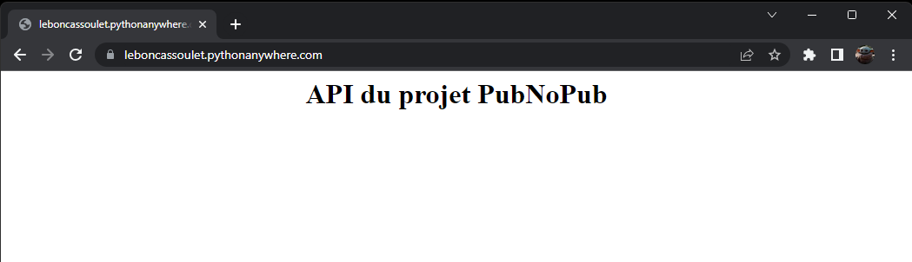
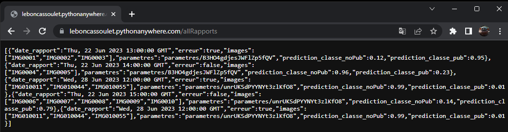
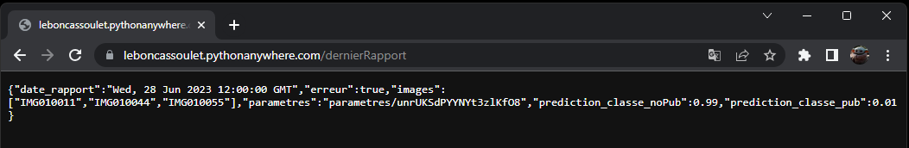
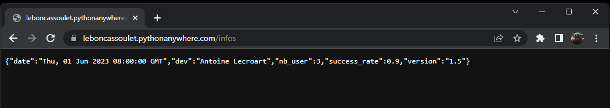
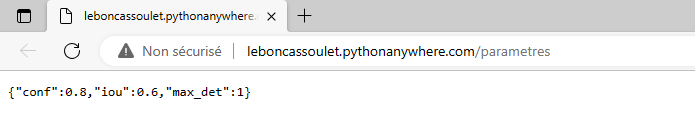
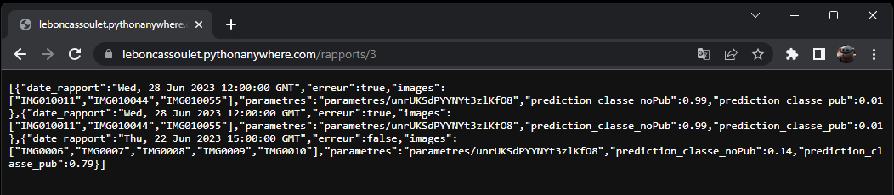

# [Dev IA GRETA / Lécroart Antoine](https://github.com/Dev-IA-2024/antoine.lecroart)

[↩️](..)
---

## Développer, déployer et tester une API pour une application d'IA

---

### Code de l'API

>[local_flask_app.py](./Fichiers/local_flask_app.py)

### Appel à l'API en Python

>[Appels_API_python.ipynb](./Appels_API_python.ipynb)

### Code du Dashboard REACT

>[BDD.js](./Fichiers/BDD.js)

### Appel à l'API par navigateur WEB

#### Endpoint : `/` (GET)

#### Endpoint : `/allRapports` (GET)

#### Endpoint : `/dernierRapport` (GET)

#### Endpoint : `/infos` (GET)

#### Endpoint : `/parametres` (GET)

#### Endpoint : `/rapports/nb` (GET)

---
---

