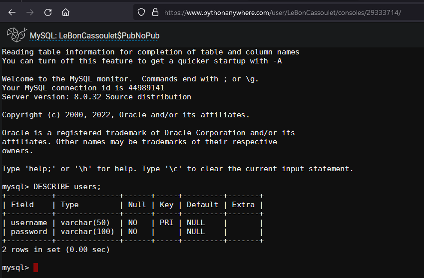
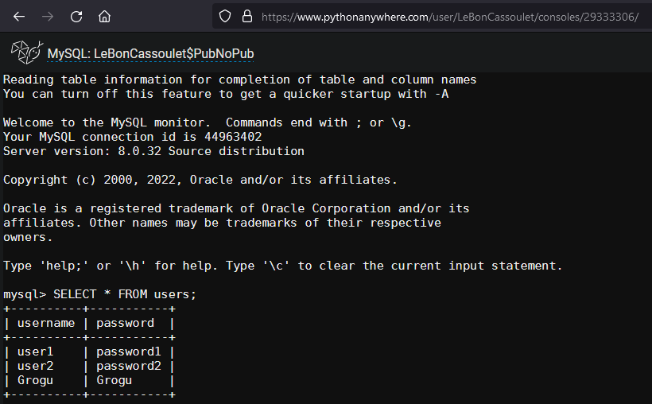

# [Dev IA GRETA / Lécroart Antoine](https://github.com/Dev-IA-2024/antoine.lecroart)

[↩️](..)
---

## Contrôle de droits utilisateurs via BDD SQL

---

### Structure de la table SQL

### Contenu de la table SQL
    

### Code de l'API Flask

>[flask_app_with_BDD.py](./Fichiers/flask_app_with_BDD.py)

- `Note`: ne marche pas en local. L'appel à une BDD de python anywhere depuis un script non-hébergé sur le site est une fonctionnalité <b>premium</b>.

### Code de test de connexion à l'API (Token & Ajout d'Users)

>[test_API.ipynb](./Fichiers/test_API.ipynb)

---
---

