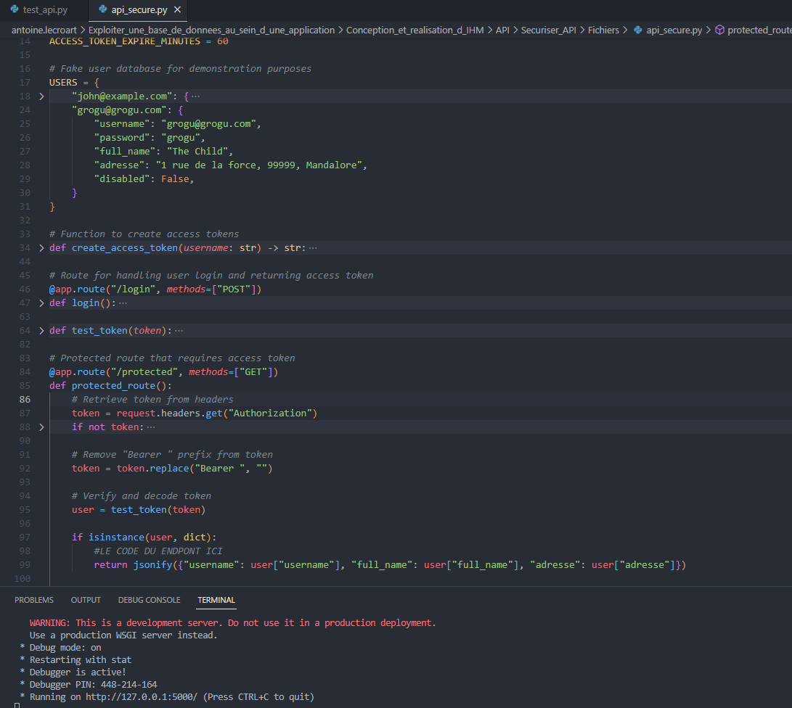
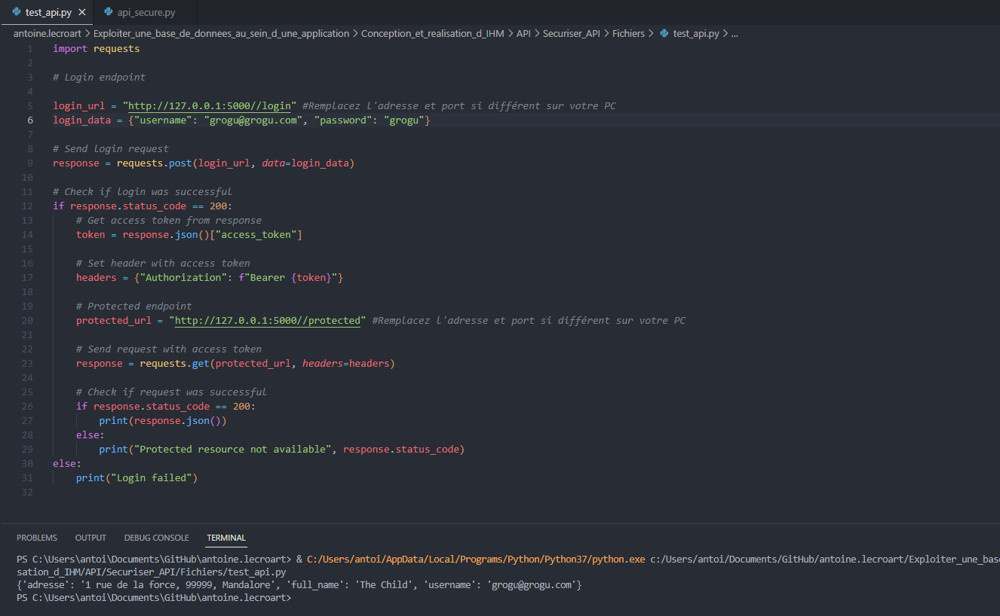

# [Dev IA GRETA / Lécroart Antoine](https://github.com/Dev-IA-2024/antoine.lecroart)

[↩️](..)
---

## Introduction aux API sécurisées

---

### Code

>[api_secure.py](./Fichiers/api_secure.py)  
>[test_api.py](./Fichiers/test_api.py)

### Exécution du code [api_secure.py](./Fichiers/api_secure.py)

### Exécution du code [test_api.py](./Fichiers/test_api.py)

    
---
---

