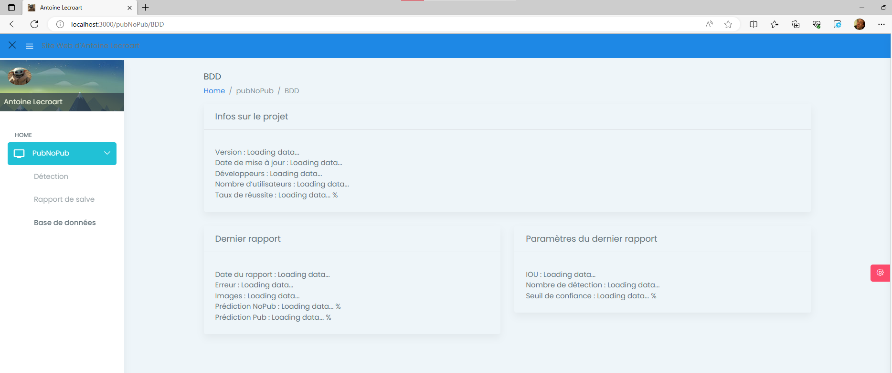
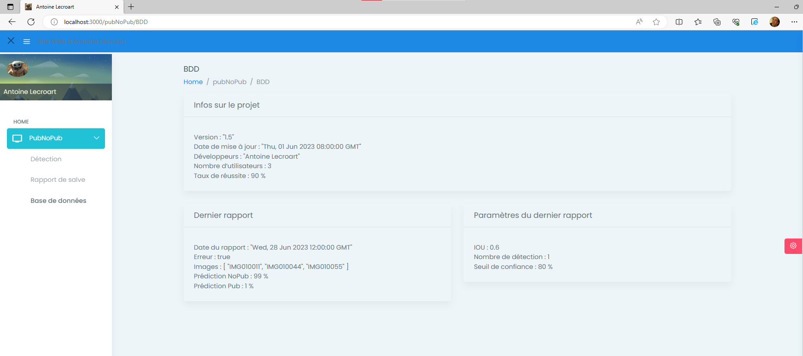

# [Dev IA GRETA / Lécroart Antoine](https://github.com/Dev-IA-2024/antoine.lecroart)

[↩️](..)
---

## Faire appel à une API depuis une application WEB react

---

### Résultat `sans` réponse de l'API



### Résultat `avec` réponse de l'API



### Code

```javascript
const BDD = () => {

  const myApi = axios.create({
    baseURL: 'http://leboncassoulet.pythonanywhere.com/',
    timeout: 50000,
    withCredentials: false,
    transformRequest: [(data) => JSON.stringify(data || {})],
    headers: {
      'Accept': 'application/json',
      'Content-Type': 'application/json',
    }
  });

  const [dataInfos, setDataInfos] = useState(null);
  const [dataRapport, setDataRapport] = useState(null);
  const [dataParametres, setDataParametres] = useState(null);


  const fetchInfos = async () => {
    try {
      const response = await myApi.get('/infos'); 
      setDataInfos(response.data);
    } catch (error) {
      console.error(error);
    }
  };

  const fetchRapport = async () => {
    try {
      const response = await myApi.get('/dernierRapport'); 
      setDataRapport(response.data);
    } catch (error) {
      console.error(error);
    }
  };

  const fetchParametres = async () => {
    try {
      const response = await myApi.get('/parametres'); 
      setDataParametres(response.data);
    } catch (error) {
      console.error(error);
    }
  };

  useEffect(() => {
    fetchInfos();
    fetchRapport();
    fetchParametres();
  }, []);

  return (
    <div>
      <BreadCrumbs />
      <Row>
        <Col lg="12">
          <ComponentCard title="Infos sur le projet">
            Version : {dataInfos ? (JSON.stringify(dataInfos.version, null, 2)) : ('Loading data...')}<br />
            Date de mise à jour : {dataInfos ? (JSON.stringify(dataInfos.date, null, 2)) : ('Loading data...')}<br />
            Développeurs : {dataInfos ? (JSON.stringify(dataInfos.dev, null, 2)) : ('Loading data...')}<br />
            Nombre d&lsquo;utilisateurs : {dataInfos ? (JSON.stringify(dataInfos.nb_user, null, 2)) : ('Loading data...')}<br />
            Taux de réussite : {dataInfos ? (Math.round(JSON.stringify(dataInfos.success_rate, null, 2) * 100)) : ('Loading data...')} %
          </ComponentCard>
        </Col>
      </Row>
      <Row>
        <Col lg="6">
          <ComponentCard title="Dernier rapport">
            Date du rapport : {dataRapport ? (JSON.stringify(dataRapport.date_rapport, null, 2)) : ('Loading data...')}<br />
            Erreur : {dataRapport ? (JSON.stringify(dataRapport.erreur, null, 2)) : ('Loading data...')}<br />
            Images : {dataRapport ? (JSON.stringify(dataRapport.images, null, 2)) : ('Loading data...')}<br />
            Prédiction NoPub : {dataRapport ? (Math.round(JSON.stringify(dataRapport.prediction_classe_noPub, null, 2) * 100)) : ('Loading data...')} %<br />
            Prédiction Pub : {dataRapport ? (Math.round(JSON.stringify(dataRapport.prediction_classe_pub, null, 2) * 100)) : ('Loading data...')} %
          </ComponentCard>
        </Col>
        <Col lg="6">
          <ComponentCard title="Paramètres du dernier rapport">
            IOU : {dataParametres ? (JSON.stringify(dataParametres.iou, null, 2)) : ('Loading data...')}<br />
            Nombre de détection :  {dataParametres ? (JSON.stringify(dataParametres.max_det, null, 2)) : ('Loading data...')}<br />
            Seuil de confiance : {dataParametres ? (Math.round(JSON.stringify(dataParametres.conf, null, 2)*100)) : ('Loading data...')} %<br />
          </ComponentCard>
        </Col>
      </Row>
    </div>
  );
};
```
---
---

