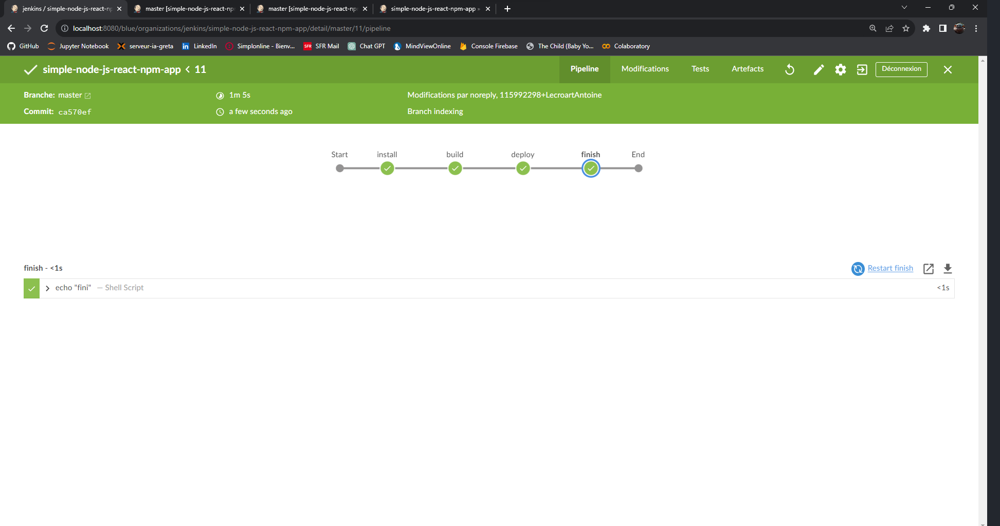
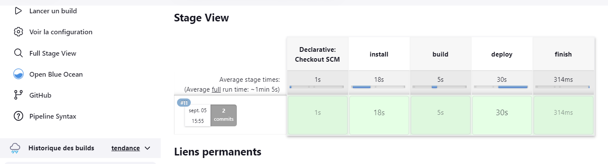
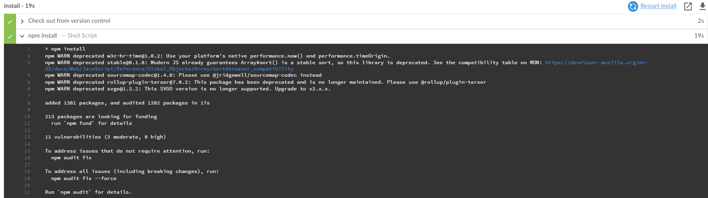
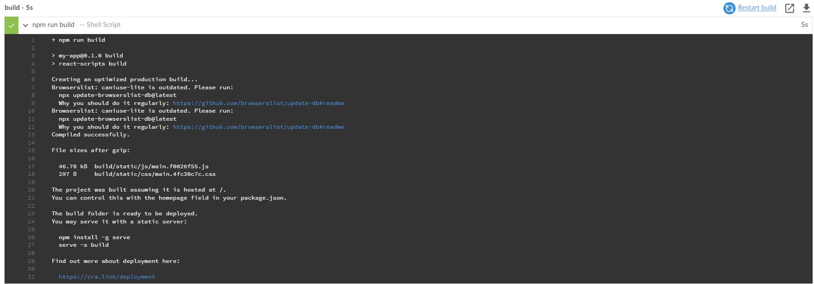
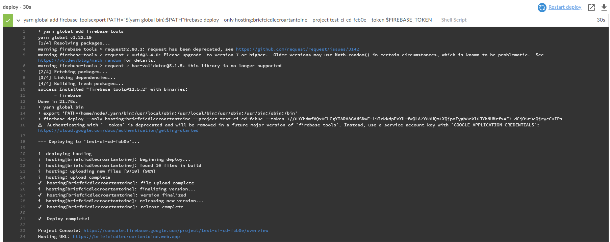
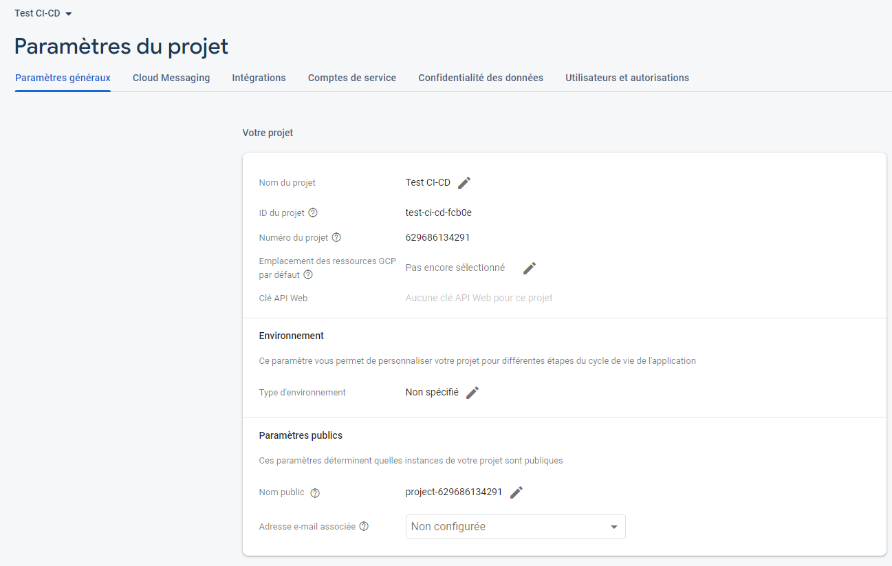

# [Dev IA GRETA / Lécroart Antoine](https://github.com/Dev-IA-2024/antoine.lecroart)

[↩️](..)
---

## Maitriser le CI/CD

---

> [Repo Github](https://github.com/LecroartAntoine/simple-node-js-react-npm-app)

> [Fichier Jenkinsfile](https://github.com/LecroartAntoine/simple-node-js-react-npm-app/blob/master/Jenkinsfile)

> [Site déployé](https://briefcicdlecroartantoine.web.app/)

---

### Execution de la pipeline

#### Log Install

#### Log Build

#### Log Deploy

---

### Paramètres du projet Firebase

---
---

