# [Dev IA GRETA / Lécroart Antoine](https://github.com/Dev-IA-2024/antoine.lecroart)

[↩️](..)
---

## Activité 1

---

### Question 1

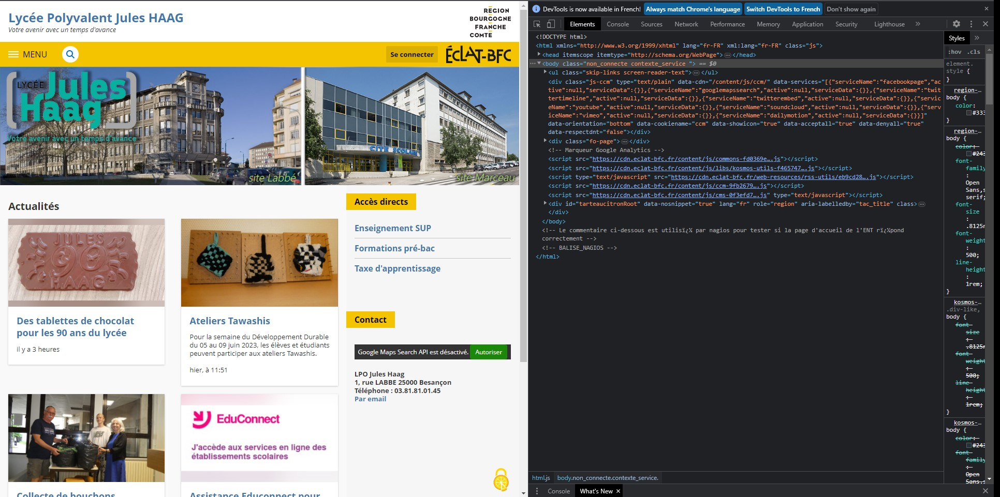

### Question 2

Le CSS, pour 'Cascading Style Sheets' ('Feuilles de style en cascade' en français), est un langage informatique utilisé sur Internet pour la mise en forme de fichiers et de pages HTML.  
Le CSS se présente comme une alternative à la mise en forme via des balises, notamment HTML. Un peu plus complexe à maîtriser, il permet un gain de temps considérable dans la mise en forme d'une page web par rapport à ces balises. Grâce au CSS, vous pouvez en effet appliquer des règles de mise en forme (titrage, alignement, polices, couleurs, bordures, etc.) à plusieurs documents simultanément.   

Sur le plan de la conception d'une page Web, le CSS permet par ailleurs de séparer la présentation d'une page HTML et sa structure. Ses standards sont définis par le World Wide Web Consortium (W3C).

### Question 3

Les versions antérieures à 11 d'Internet Explorer ne supportent pas le "Built-in PDF Viewer". La version 11 nécéssite d'être installé sur windows 10+ pour permettre l’utilisation du "Built-in PDF Viewer".

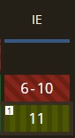

### Question 4

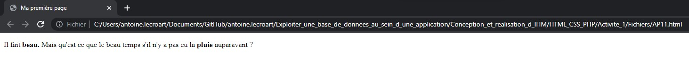

- `
` : Cette balise sert à définir un paragraphe.

- `<b>` : Cette balise sert à montrer le texte en <b>gras</b> (bold en anglais).

- Les sauts de lignes et tabulations n'ont pas d'éffets en language html.

### Question 5

Il faut utiliser ` ` pour le saut de ligne en HTML. Cette balise n'a pas besoin d'être fermé (` `). On peut d'ailleurs écrire ` ` ou ` `, les deux ont le même comportement.

### Question 6 

L'<b>utf-8</b> appartient au système d'encodage <b>Unicode</b>.   
<b>UTF</b> est l'abréviation de "Unicode Transformation Format" ou Format de Transformation Unicode.   
Ce système permet de passer du binaire au texte et inversement.  
L'<b>utf-8</b> permet l'encodage de `1,112,064` caractère.  

### Question 7

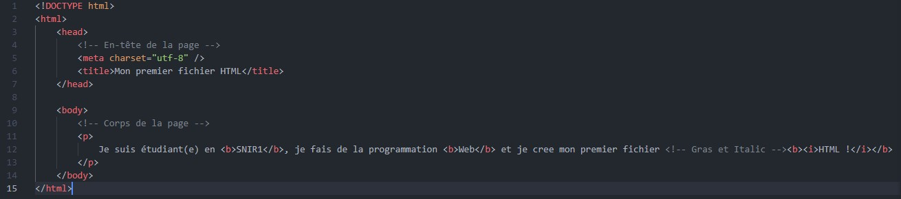
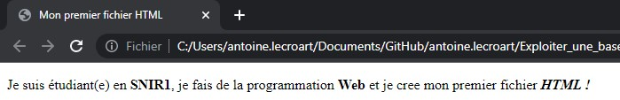

### Question 8

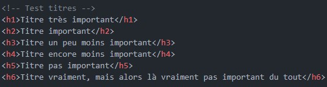
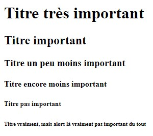

### Question 9

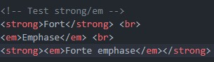
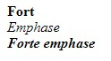

### Question 10

- `<ul>` créer une liste non ordonnée
- `<ol>` créer une liste ordonnée

### Question 11

#### Page 1
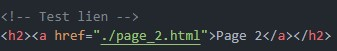
#### Page 2

### Question 12

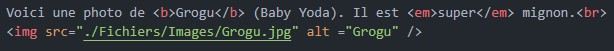

### Question 13

La balise `alt` sert à afficher le texte alternatif d'une image. Si par exemple l'image n'est plus accessible, le texte alternatif sera affiché. 

### Question 14

Ce code permet de colorier le texte des paragraphes en bleu.

### Question 15

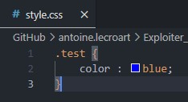
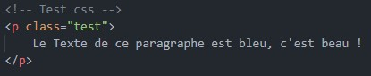

Les classes sont utilisées pour appliquer des styles à plusieurs éléments d'une page, tandis que les identifiants sont destinés à identifier de manière unique un seul élément.

### Question 16

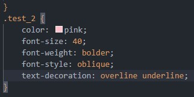

### Question 17

- Apache : Apache est un logiciel serveur web chargé d'accepter les requêtes HTTP des visiteurs et de leur renvoyer les informations demandées sous la forme de pages web.
- PHP est l'acronyme de Hypertext Preprocessor. Il s'agit d'un langage de script côté serveur en open source utilisé pour le développement dynamique de sites web et pouvant être intégré dans des codes HTML.
- MySQL : MySQL est un système de gestion de base de données relationnelles (SGBDR).

### Question 18

MySQL n'est pas nécessaire car nous n'avons pas de données structurées à intégrer à notre serveur (juste une images, un css, des fichiers html...)

### Question 19

`index.html` est en général la première page qui s'affiche quand on se rend sur un site web, c'est la page d'acceuil depuis laquelle les autres pages sont accèssible (d'où le nom `index`).

---
---

