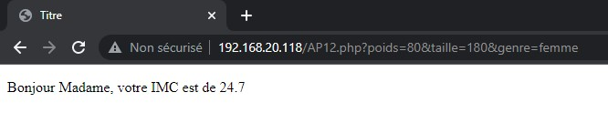

# [Dev IA GRETA / Lécroart Antoine](https://github.com/Dev-IA-2024/antoine.lecroart)

[↩️](..)
---

## Activité 2

---

### Question 1

PHP est conçu pour servir de langage de script coté serveur, il ne marche donc pas s'il on ouvre le fichier html directement. Il nous faut un serveur.

### Question 2 

### Question 3

### Question 4

#### `Post`

#### `Get`

#### Changement

#### Résultat

### Question 5

Les données sont transmisent dans l'url.

### Question 6

#### HTML

#### PHP

#### Formulaire

#### Réponse

---
---

