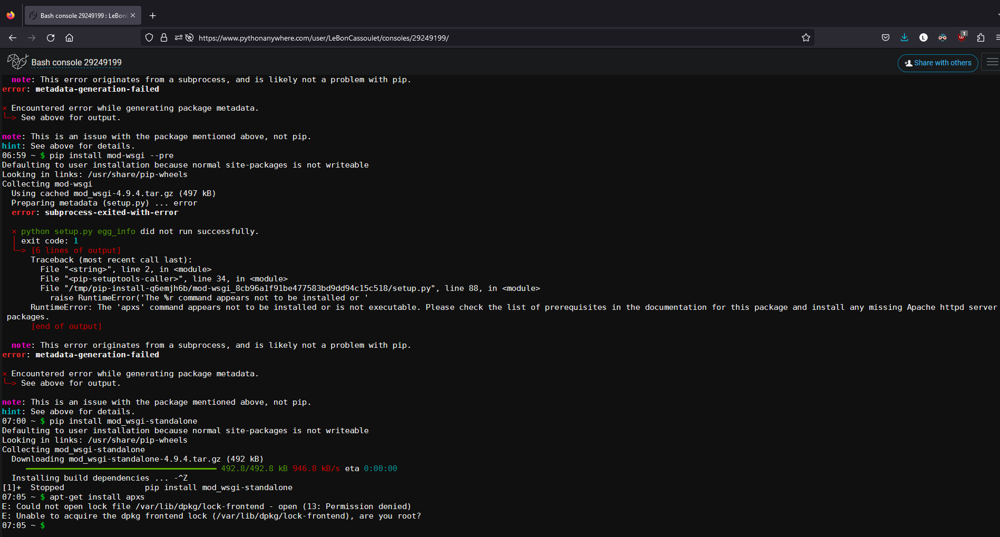
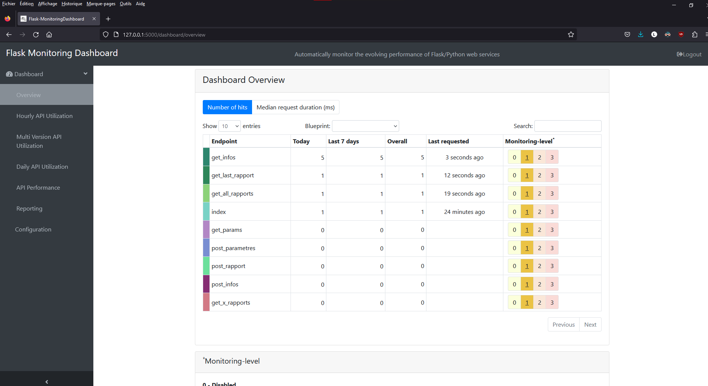

# [Dev IA GRETA / Lécroart Antoine](https://github.com/Dev-IA-2024/antoine.lecroart)

[↩️](..)
---

## Monitoring API avec FlaskDashboard

---

### Code API

>[local_flask_app.py](./Fichiers/local_flask_app.py)

### Erreur sur console PythonAnywhere

### Dashboard en local

### Comparatif entre FaskDashboard, Graphana et Prometheus

| Caractéristiques                     | FlaskDashboard                                                                                           | Grafana                                                                                              | Prometheus                                                                                             |
|--------------------------------------|----------------------------------------------------------------------------------------------------------|------------------------------------------------------------------------------------------------------|--------------------------------------------------------------------------------------------------------|
| Type                                 | Framework Python pour la création de tableaux de bord et d'applications web                             | Outil de visualisation de données et de monitoring                                                 | Système de monitoring et de gestion de métriques                                                     |
| Langage de programmation pris en charge  | Python                                                                                                   | N/A                                                                                                | N/A                                                                                                  |
| Interface utilisateur                | Possède une interface utilisateur basée sur le Web pour la création et la gestion des tableaux de bord  | Interface utilisateur web intuitive pour la création et la visualisation des tableaux de bord      | Interface utilisateur web pour la visualisation des métriques et la configuration des alertes          |
| Fonctionnalités de visualisation      | Prise en charge de diverses bibliothèques de visualisation, y compris Plotly, Matplotlib, etc.          | Large gamme de graphiques et de panneaux personnalisables                                          | Graphiques de séries temporelles, histogrammes, tableaux, graphiques en camembert, etc.                  |
| Intégration avec d'autres outils      | Peut être intégré à d'autres frameworks Python et outils de visualisation                             | Peut être intégré à différents outils de monitoring et de visualisation                           | Peut être intégré à d'autres systèmes de monitoring et d'alerte                                         |
| Collecte de données                   | Doit être configuré manuellement pour récupérer les données à partir de sources externes                 | Prend en charge la collecte de données à partir d'une variété de sources, y compris des bases de données, des API, etc. | Collecte de données à partir de diverses sources, notamment des agents d'exposition et des services tiers |
| Stockage des données                   | Peut utiliser diverses bases de données pour stocker les données, comme MySQL, PostgreSQL, etc.          | Utilise une base de données intégrée appelée Graphite pour stocker les données de métriques           | Stocke les données de métriques dans une base de données en temps réel appelée Time-Series Database       |
| Fonctionnalités de requête             | Permet d'effectuer des requêtes personnalisées sur les données et d'appliquer des filtres               | Offre une large gamme de fonctions de requête, y compris des agrégations, des filtres, des jointures, etc. | Prend en charge les requêtes PromQL pour récupérer et analyser les métriques                            |
| Extensibilité et personnalisation      | Peut être étendu en utilisant des plugins et des modules complémentaires                                 | Offre un écosystème riche de plugins et de visualisations personnalisées                           | Possibilité d'étendre les fonctionnalités à l'aide de bibliothèques, d'exporteurs et de modules complémentaires |
| Communauté et support                  | Communauté active et documentation détaillée disponible                                                  | Communauté active et support de la part de Grafana Labs                                             | Communauté active et support de la part de la Fondation Prometheus                                       |

---
---

