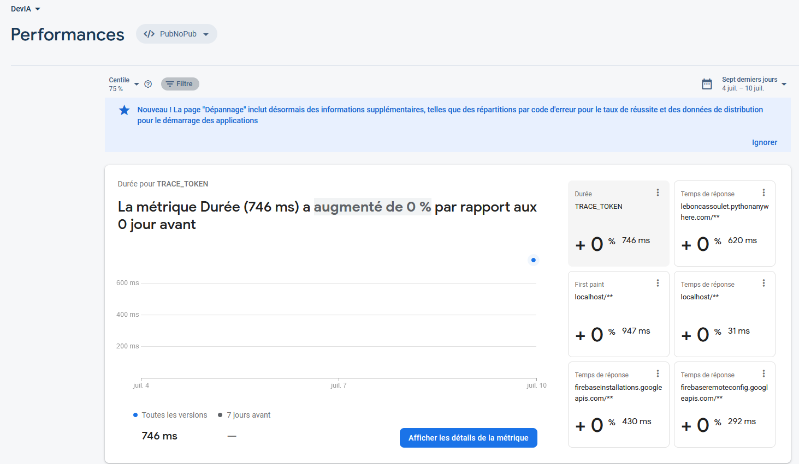

# [Dev IA GRETA / Lécroart Antoine](https://github.com/Dev-IA-2024/antoine.lecroart)

[↩️](..)
---

## Utiliser l'outil performance de Firebase pour monitorer une application WEB

---

### Outil Firebase Performace

### Code Firebase

>[Firebase.js](./Fichiers/Firebase.js)

### Code Dashboard avec trace

>[BDD.js](./Fichiers/BDD.js)

---
---

