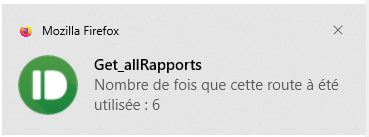
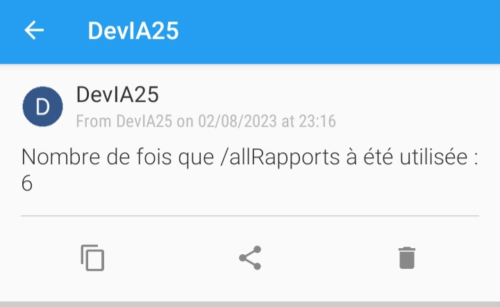
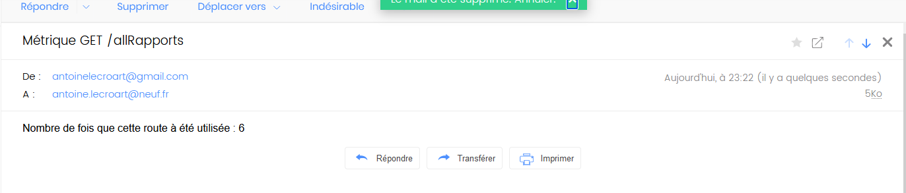

# [Dev IA GRETA / Lécroart Antoine](https://github.com/Dev-IA-2024/antoine.lecroart)

[↩️](..)
---

## Mettre en place le système d'alerte pour le monitoring

---

>[Code de l'API en local](./Fichiers/local_flask_app.py) 
>[Code de test PushBullet](./Fichiers/pushbullet_test.py) 
>[Code de test PushOver](./Fichiers/pushover_test.py) 
>[Code de test Smtplib (Mail)](./Fichiers/smtplib_test.py)

---

### Résulat notification PushBullet

---

### Résulat notification PushOver

---

### Résulat Mail SmtpLib

---
---

