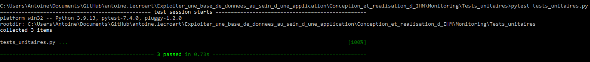
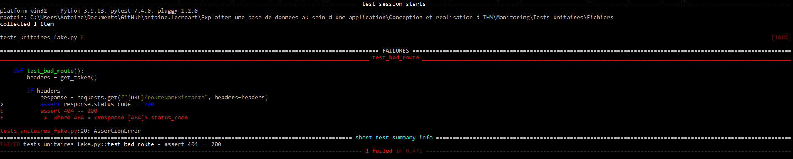

# [Dev IA GRETA / Lécroart Antoine](https://github.com/Dev-IA-2024/antoine.lecroart)

[↩️](..)
---

## Mettre en oeuvre les tests unitaires de l'application

---

>[Code de l'API](./Fichiers/local_flask_app_secured.py) <br>
>[Code de test unitaire](./Fichiers/tests_unitaires.py)

---

### Lancer l'API

L'API doit tourner en local (version post-BDD python anywhere). Il faut lancer la console à partir du chemin [Test_unitaires/Fichiers](./Fichiers/) puis :

```bash
python local_flask_app_secured.py
```

---

### Réaliser les tests unitaires

Pour tester le code de test unitaire, il faut lancer la console à partir du chemin [Test_unitaires/Fichiers](./Fichiers/) puis :

```bash
pytest tests_unitaires.py
```

---

### Tests de `\allRapports`, `\infos` & `\parametres`



---

### Test de `\routeNonExistante`



---
---

