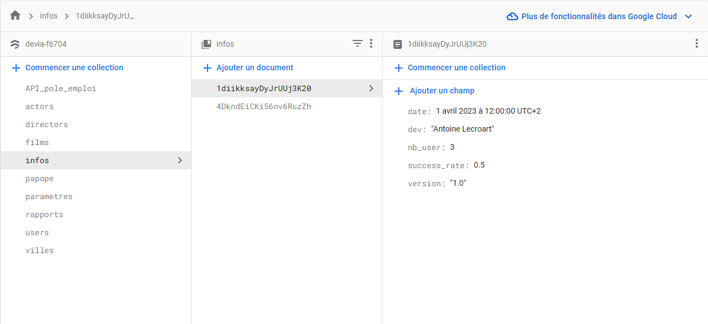
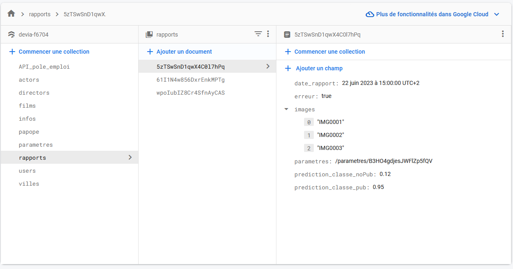
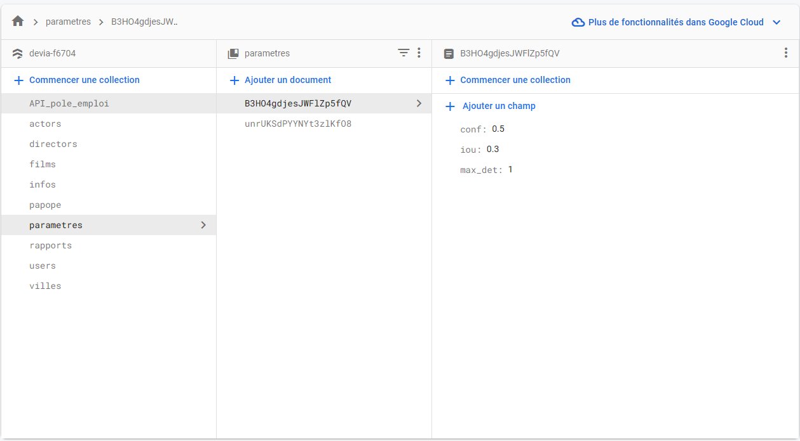
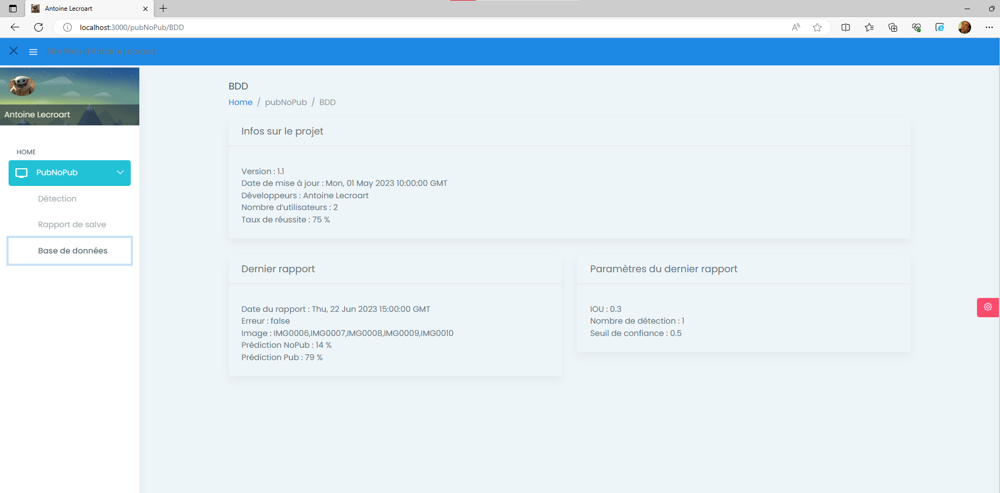

# [Dev IA GRETA / Lécroart Antoine](https://github.com/Dev-IA-2024/antoine.lecroart)

[↩️](..)
---

## Relier une IHM WEB REACT avec Firestore

- Le Fichier 'Fichiers/BDD.js' contient le code permettant l'affichage des données récupérées sur Firestore. 
- Le Fichier 'Fichiers/Firebase.js' contient le code permettant la connexion à Firestore. 
- Les 3 collections en format JSON sont stockées dans le dossiers 'Fichiers/Jsons'
- [Lien IHM WEB](https://devia-f6704.web.app/)

### Firestore

#### Collection : Infos

#### Collection : Rapports

#### Collection : Parametres

### Résultat

---
---

