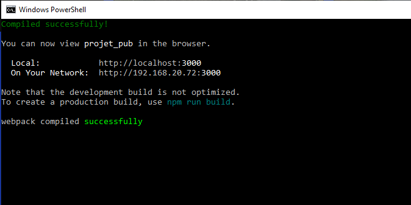
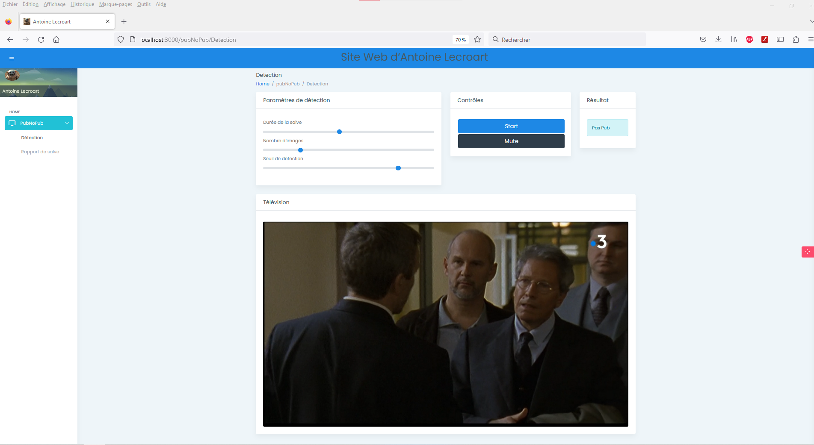
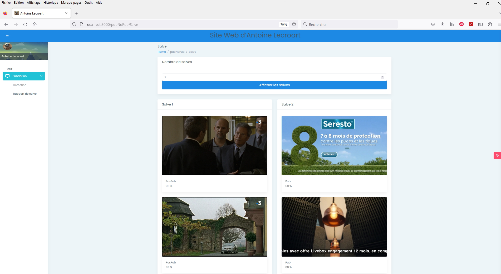

# [Dev IA GRETA / Lécroart Antoine](https://github.com/Dev-IA-2024/antoine.lecroart)

[↩️](..)
---

## Réaliser une interface WEB avec REACT

---

### Maquette Figma

[Lien](https://www.figma.com/file/hnGljg61GjLfggyqZisBAl/IHM-Pub?type=design&node-id=2%3A2&t=KSSzVk9b7OZ56LL6-1)

### Résultat

---
---

