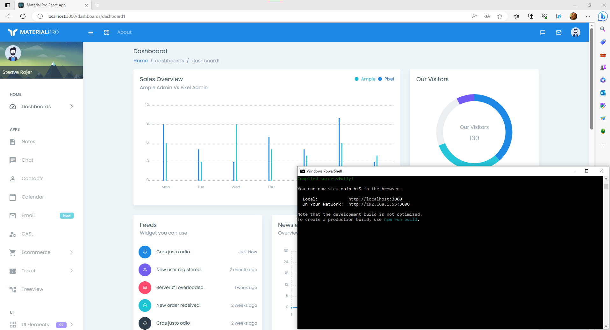

# [Dev IA GRETA / Lécroart Antoine](https://github.com/Dev-IA-2024/antoine.lecroart)

[↩️](..)
---

## Prendre en main REACT

---

### Qu'est ce que REACT ?

React (aussi appelé React.js ou ReactJS) est une bibliothèque JavaScript libre développée par Facebook depuis 2013.   
Le but principal de cette bibliothèque est de faciliter la création d'application web monopage, via la création de composants dépendant d'un état et générant une page (ou portion) HTML à chaque changement d'état. 

### Installation de NodeJS et lancement du serveur

- Télécharger et installer node.js : https://nodejs.org/en
- A l'installation de node.js, installer les modules complémentaires (cette étape peut prendre 15-30min)
- Télécharger le template, extraire template-initial
- Ouvrir l'invite de commande (pas dans VsCode)
- Se place dans le dossier template-initial/package/main
- Exécuter la commande "npm install" pour installer les dépendances
- Exécuter la commande "set NODE_OPTIONS=--openssl-legacy-provider"
- Exécuter la commande "npm run start" (toujours dans le cmd, toujours dans template-initial/package/main)
- Attendre 3-5 min, ouvrir la page web "localhost:3000"

## Résultat

---
---

