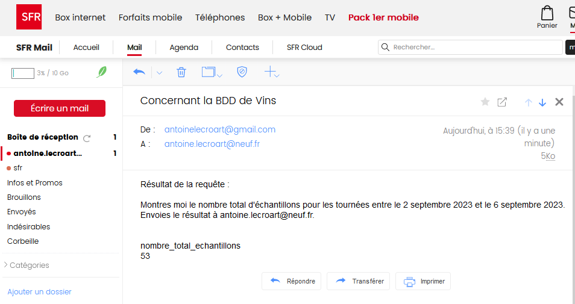

# [Dev IA GRETA / Lécroart Antoine](https://github.com/Dev-IA-2024/antoine.lecroart)

[↩️](..)
---

## Gestion d'une BDD en langage naturel

---
---

### Général

> [Code de l'application](./Code_fenetre/main.py)

> [Utilisation d'OpenAI](./Code_fenetre/AI_Thread.py)

> [API Flask CRUD sur Docker](./API_CRUD/)

---
---

### Librairies pour le projet

Se placer dans le dossier [Fichiers](./Fichiers), ouvrir une invite de commande :

```Bash
pip install requirements.txt
```

---
---

### Instalation sur Docker

Se placer dans le dossier [Fichiers](./Fichiers), ouvrir une invite de commande :

```Bash
docker-compose up -d 
```

---
---

### Initialisation BDD

- Ouvrir un navigateur ---> [localhost:8080](http://localhost:8080/).</br>
- Se connecter à PhpMyAdmin :
    - username : root
    - password : admin </br>

- Ouvrir l'onglet 'SQL'.

- Exécuter les scripts SQL suivants :


---

#### Création de la base des utilisateurs `DB_users`

```SQL
CREATE DATABASE IF NOT EXISTS DB_users;
```

##### Ajout des tables utilisateurs

```SQL
USE DB_users;

DROP TABLE IF EXISTS identifiants;

CREATE TABLE identifiants (
    id_user INT AUTO_INCREMENT PRIMARY KEY,
    username VARCHAR(50),
    password VARCHAR(50)
);
```

##### Ajout de valeurs utilisateurs

```SQL
USE DB_users;

INSERT INTO identifiants (username, password) VALUES
('LeBonCassoulet', 'azertyuiop');
```

---

#### Création de la base de vins`stock_vins`

```SQL
CREATE DATABASE IF NOT EXISTS stock_vins;
```

##### Ajout des tables de vins

```SQL
USE stock_vins;

DROP TABLE IF EXISTS Vendre;
DROP TABLE IF EXISTS Cuves;
DROP TABLE IF EXISTS Vins;
DROP TABLE IF EXISTS Cave;
DROP TABLE IF EXISTS Tournees;

CREATE TABLE Cave (
    id_cave INT AUTO_INCREMENT PRIMARY KEY,
    nom_cave VARCHAR(50),
    adresse_cave VARCHAR(50)
);

CREATE TABLE Tournees (
    date_tournee DATE PRIMARY KEY,
    nbre_echantillons_tournee INT
);

CREATE TABLE Vins (
    id_vin INT AUTO_INCREMENT PRIMARY KEY,
    millesime_vin INT,
    date_vin DATE,
    couleur_vin VARCHAR(50),
    commentaire_vin VARCHAR(50),
    numero_cuve VARCHAR(50)
);

CREATE TABLE Cuves (
    numero_cuve VARCHAR(50) PRIMARY KEY,
    volume_cuve FLOAT(25),
    type_cuve VARCHAR(50),
    id_vin INT,
    date_tournee DATE
);

CREATE TABLE Vendre (
    id_vin INT,
    id_cave INT,
    PRIMARY KEY (id_vin, id_cave)
);
```

##### Ajout de valeurs de vins

```SQL
USE stock_vins;

INSERT INTO Cave (id_cave, nom_cave, adresse_cave) VALUES
(1, 'Cave A', '123 Vineyard Lane'),
(2, 'Cave B', '456 Wine Street'),
(3, 'Cave C', '789 Cellar Road'),
(4, 'Cave D', '101 Wine Cellar Avenue'),
(5, 'Cave E', '222 Oak Barrel Street'),
(6, 'Cave F', '333 Wine Storage Lane'),
(7, 'Cave G', '444 Vineyard Road'),
(8, 'Cave H', '555 Cellar Street'),
(9, 'Cave I', '666 Wine Lane'),
(10, 'Cave J', '777 Vineyard Avenue');

INSERT INTO Tournees (date_tournee, nbre_echantillons_tournee) VALUES
('2023-09-01', 15),
('2023-09-02', 12),
('2023-09-03', 10),
('2023-09-04', 8),
('2023-09-05', 14),
('2023-09-06', 9),
('2023-09-07', 11),
('2023-09-08', 13),
('2023-09-09', 7),
('2023-09-10', 16);

INSERT INTO Vins (id_vin, millesime_vin, date_vin, couleur_vin, commentaire_vin, numero_cuve) VALUES
(1, 2019, '2023-01-15', 'Red', 'Smooth and fruity', 'CUV001'),
(2, 2020, '2023-02-20', 'White', 'Crisp and refreshing', 'CUV002'),
(3, 2018, '2023-03-25', 'Red', 'Bold and spicy', 'CUV003'),
(4, 2022, '2023-04-10', 'Rosé', 'Light and fruity', 'CUV004'),
(5, 2017, '2023-05-05', 'Red', 'Complex and aged', 'CUV005'),
(6, 2021, '2023-06-30', 'White', 'Buttery and oaked', 'CUV006'),
(7, 2019, '2023-07-22', 'Red', 'Rich and full-bodied', 'CUV007'),
(8, 2020, '2023-08-18', 'Rosé', 'Crisp and fruity', 'CUV008'),
(9, 2018, '2023-09-10', 'Red', 'Velvety and aromatic', 'CUV009'),
(10, 2022, '2023-10-05', 'White', 'Citrusy and vibrant', 'CUV010');

INSERT INTO Cuves (numero_cuve, volume_cuve, type_cuve, id_vin, date_tournee) VALUES
('CUV001', 1000.0, 'Oak', 1, '2023-09-01'),
('CUV002', 800.0, 'Stainless Steel', 2, '2023-09-02'),
('CUV003', 1200.0, 'Oak', 3, '2023-09-03'),
('CUV004', 600.0, 'Stainless Steel', 4, '2023-09-04'),
('CUV005', 1500.0, 'Oak', 5, '2023-09-05'),
('CUV006', 900.0, 'Stainless Steel', 6, '2023-09-06'),
('CUV007', 1100.0, 'Oak', 7, '2023-09-07'),
('CUV008', 750.0, 'Stainless Steel', 8, '2023-09-08'),
('CUV009', 1300.0, 'Oak', 9, '2023-09-09'),
('CUV010', 850.0, 'Stainless Steel', 10, '2023-09-10');

INSERT INTO Vendre (id_vin, id_cave) VALUES
(1, 1),
(2, 2),
(3, 3),
(4, 4),
(5, 5),
(6, 6),
(7, 7),
(8, 8),
(9, 9),
(10, 10);
```

---
---

### Fonctionnement du logiciel

---

#### Requête SELECT

##### Simple


##### Plus complexe


#### Requête INSERT


#### Requête DELETE


#### Requête UPDATE


#### Envoie de mails




#### Exemple de Log


#### Upload des logs sur BDD


#### Upload des avis sur BDD


---
---

